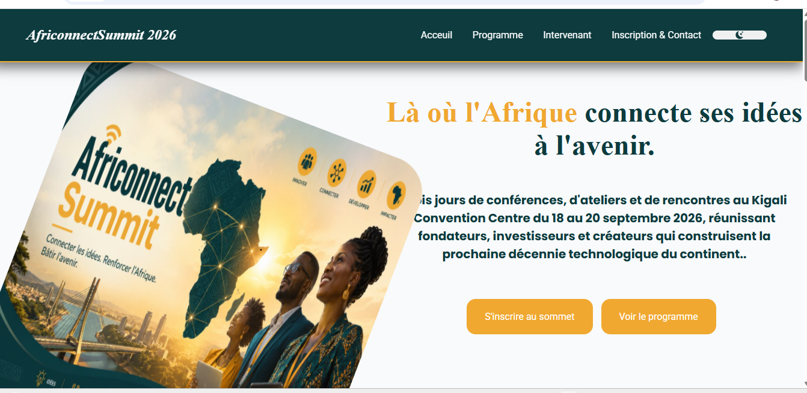
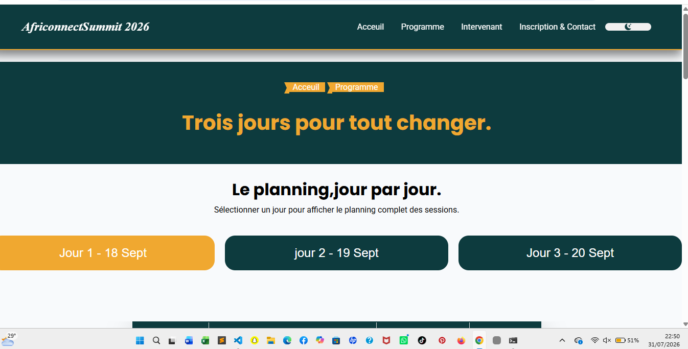
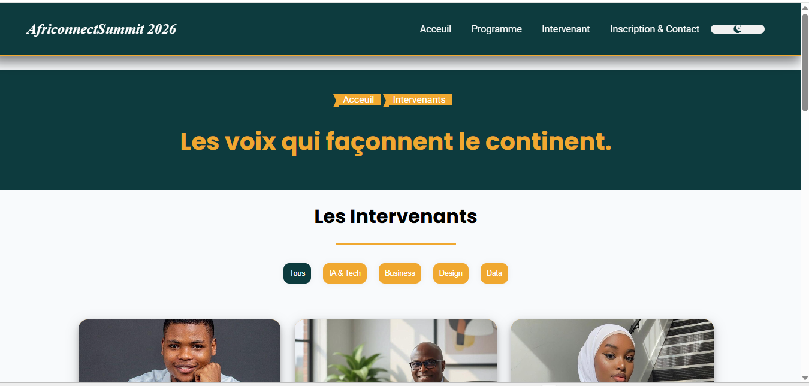
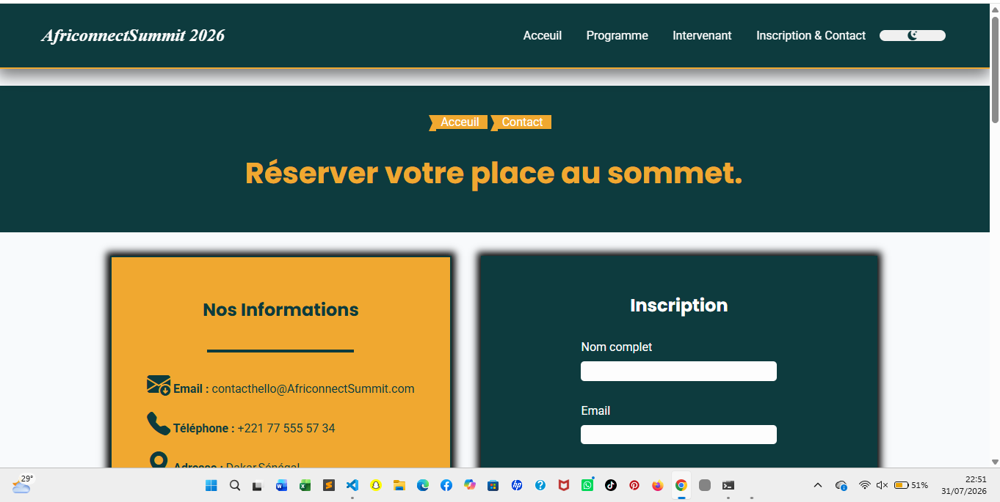

#AfriconnectSummit
Projet fil rouge - Plateforme de mise en relation entre developpeurs ,entrepreneurs et investisseur du continent .
Auteur : Mariata Ba
Promotion : L1 Web - ISI

# 🌍 AfriconnectSummit 2026


Site web vitrine pour *AfriconnectSummit*, un sommet panafricain de 3 jours (18–20 septembre 2026) réunissant fondateurs, investisseurs et créateurs autour de l'IA, la fintech, l'énergie, le design et la data.


## 📋 Aperçu du site
   # Page d'acceuil (index.html)

   # Programme (prgramme.html)

   # Intervenant (intervenant.html)

   # Contact (inscription et contact)


Le site est composé de 4 pages HTML statiques, stylées avec un CSS unique et animées via un script JavaScript commun :

| Page | Description |
|---|---|
| index.html | Page d'accueil : hero, compte à rebours, chiffres clés, pourquoi participer, intervenants vedettes, sponsors |
| programme.html | Planning des 3 jours du sommet (onglets par jour) et les 4 thématiques de la conférence |
| intervenants.html | Liste filtrable des intervenants par catégorie (IA & Tech, Business, Design, Data) |
| contact.html | Formulaire d'inscription avec validation, FAQ et carte de localisation |

### Mode sombre
- Toggle dark mode persistant grâce à `localStorage`
- Icône lune/soleil selon le thème actif

### Animations
- **Fade-in** au scroll via `IntersectionObserver` (`.fade-in` → `.visible`)
- **Compteurs animés** déclenchés à l'entrée dans le viewport (`IntersectionObserver`)

## 📁 Structure du projet
C:.
│   contact.html
│   index.html
│   intervenants.html
│   programme.html
│   README.md
│
├───css
│       style.css
│
├───images
│       1.jpeg
│       10.jpeg
│       100.jpeg
│       101.jpeg
│       102.jpeg
│       103jpeg.jpeg
│       104.jpeg
│       11.jpeg
│       12.jpeg
│       13.jpeg
│       14.jpeg
│       15.jpeg
│       16.jpeg
│       17.jpeg
│       18.jpeg
│       19.jpeg
│       2.jpeg
│       20.jpeg
│       21.jpeg
│       22.jpeg
│       23.jpeg
│       24.jpeg
│       25.jpeg
│       26.jpeg
│       27.jpeg
│       28.jpeg
│       3.jpeg
│       4.jpeg
│       5.jpeg
│       6.jpeg
│       7.jpeg
│       8.jpeg
│       80.jpeg
│       9.jpeg
│       contac.png
│       index.png
│       intervena.png
│       logo.jpeg
│       progra.png
│       video.mp4
│       WhatsApp Image .jpeg
│
└───js
        main.js

## ✨ Fonctionnalités

- *Mode sombre / clair* — bouton de bascule avec persistance via localStorage
- *Compte à rebours* en temps réel jusqu'au début de l'événement
- *Compteurs animés* (participants, intervenants, jours, pays) déclenchés au scroll
- *Filtrage des intervenants* par catégorie
- *Planning à onglets* (Jour 1 / Jour 2 / Jour 3)
- *Formulaire d'inscription* avec validation côté client (nom, email, téléphone, type de participation, message)
- *FAQ en accordéon* (<details> / <summary>)
- *Menu hamburger* responsive + navbar qui change de style au scroll
- *Animations au scroll* (fade-in, zoom, effets de survol)
- Design *responsive* (breakpoints tablette 768–1024px et mobile 375–480px)

## 🛠️ Technologies utilisées

- HTML5 / CSS3 (variables CSS, Grid, Flexbox, media queries)
- JavaScript vanilla (pas de framework)
- [Bootstrap Icons](https://icons.getbootstrap.com/) via CDN
- Google Fonts : Poppins, Roboto, Open Sans, Inter
- Google Maps (iframe intégré) pour la localisation

## 📚 Ressources et documentation utilisées

- [MDN Web Docs](https://developer.mozilla.org/fr/) — référence HTML / CSS / JavaScript
- [Documentation Bootstrap Icons](https://icons.getbootstrap.com/) — iconographie du site
- [Google Fonts](https://fonts.google.com/) — polices Poppins, Roboto, Open Sans, Inter
- [Can I Use](https://caniuse.com/) — compatibilité navigateurs
- [Stack Overflow](https://stackoverflow.com/) — débogage ciblé

## 🚀 Installation / utilisation

Aucune dépendance ni build n'est nécessaire, il s'agit d'un site statique.

1. Cloner ou télécharger le projet
2. Ouvrir index.html dans un navigateur, ou servir le dossier avec un serveur local, par exemple :
   ```bash
      git clone  https://github.com/mariata221/Ba-Mariata-AfriconnectSummit.git

      ## 📄 Licence
© 2026 AfriconnectSummit. Tous droits réservés